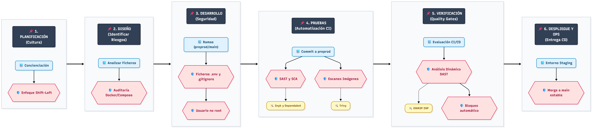

# Actividad 2 y 3: S-SDLC, DevSecOps y evaluación automática de seguridad

## 1. Introducción

Este repositorio contiene el trabajo grupal desarrollado sobre una Web-App tipo **To-Do** para la asignatura **Metodologías de Desarrollo Seguro**.

La entrega unifica dos partes:

- **Actividad 2:** incorporación de S-SDLC y DevSecOps en el proyecto tipo.
- **Actividad 3:** evaluación de la seguridad mediante herramientas automáticas.

La idea del proyecto es mantener una aplicación sencilla, pero suficientemente completa para aplicar controles reales de seguridad: ejecución con Docker, revisión de dependencias, escaneo de secretos, análisis estático, análisis dinámico, escaneo de red y documentación de resultados.

---

## 2. Miembros del equipo y repositorios base

| Miembro | Matrícula / usuario UEM | Repositorio actividad anterior | Aplicación |
|---|---:|---|---|
| Iván Jiménez Caidas | 224c8130 | Entregado en local | To-Do App |
| Sergio González Martín | 2181960 | https://github.com/porteroFitness/Met_Desarrollo_Seguro-To_Do-Secured_A1 | To-Do App |
| Daniel Asensio Vázquez | 224b9614 | https://github.com/dasensio03/secure-todo-sdlc | To-Do App |
| Mario Martín Fernández | 224a9917 | https://github.com/mario2448/Actividad-1-ToDo-Mario | To-Do App |

> Solo se incluyen los identificadores académicos. No se incluyen correos electrónicos completos.

---

## 3. Definición de la aplicación

El proyecto final se basa en una Web-App tipo **To-Do**, utilizada por los miembros del grupo en la actividad anterior. Al haber trabajado todos sobre la misma aplicación base, la unificación no consiste en mezclar aplicaciones diferentes, sino en construir una versión común más completa.

La aplicación permite gestionar tareas desde una interfaz web y se ejecuta mediante Docker, lo que facilita un entorno reproducible y aislado.

### Arquitectura prevista

- Proxy inverso: Traefik.
- Frontend: React.js.
- Backend: Node.js.
- Base de datos: MySQL.
- Gestión de base de datos: phpMyAdmin.
- Contenerización: Docker y Docker Compose.

---

## 4. Cómo ejecutar la aplicación

Desde la raíz del repositorio:

```bash
git clone https://github.com/mario2448/Actividad-2-DevSecOps-Grupo.git
cd Actividad-2-DevSecOps-Grupo
cp .env.example .env
docker compose up -d --build
docker ps
```

Para detener los contenedores:

```bash
docker compose down
```

---

## 5. Actividad 2 - S-SDLC y DevSecOps

La Actividad 2 consistió en diseñar una versión común de la aplicación To-Do incorporando seguridad desde el diseño y planteando un flujo DevSecOps.

### 5.1. Revisión de proyectos individuales

| Miembro | Medidas identificadas | Fase S-SDLC relacionada | Estado |
|---|---|---|---|
| Iván Jiménez Caidas | Enfoque Shift-Left y Business Recovery Plan. Análisis SAST en pull requests. Uso de SCA para generar un SBOM de dependencias. Pruebas DAST y protección activa. | Diseño, implementación, construcción, pruebas, despliegue y mantenimiento. | Aprovechable |
| Sergio González Martín | Uso de ramas, control de versiones, `.env`, `.gitignore`, Trivy, SAST/SCA, Quality Gates y entorno staging. | Diseño, desarrollo, pruebas, verificación y despliegue. | Aprovechable |
| Daniel Asensio Vázquez | Ejecución Docker, documentación S-SDLC, pruebas con `npm audit`, estructura `docs/security/tests` y evidencias. | Requisitos, diseño, implementación, pruebas y mantenimiento. | Aprovechable |
| Mario Martín Fernández | Usuario no root en Dockerfile, variables de entorno, `.gitignore/.dockerignore`, exposición mínima de red, revisión con `npm audit` y plan de pruebas con Trivy y OWASP ZAP. | Requisitos, diseño, desarrollo, pruebas y mantenimiento. | Aprovechable |

### 5.2. Unificación del proyecto

La versión común integra las mejores prácticas observadas en los proyectos individuales:

- Ejecución mediante Docker Compose.
- Uso de `.env` para variables sensibles.
- Inclusión de `.env` en `.gitignore`.
- Archivo `.env.example` con valores de ejemplo.
- Revisión de `Dockerfile` y `compose.yaml`.
- Uso de ramas `main`, `preprod` y `feature/fix`.
- Análisis SAST con Snyk.
- Análisis SCA con GitHub Dependabot.
- Detección de secretos con GitHub Secret Scanning.
- Escaneo de imágenes Docker con Trivy.
- Escaneo de red con Nmap.
- Pruebas DAST con OWASP ZAP.
- Quality Gates para bloquear vulnerabilidades altas o críticas.
- Despliegue en staging antes de fusionar a `main`.

### 5.3. Consideraciones de seguridad durante el diseño

| Riesgo | Ubicación | Medida propuesta |
|---|---|---|
| Credenciales hardcodeadas | `compose.yaml` | Usar `.env` y subir solo `.env.example`. |
| Exposición accidental de secretos | GitHub | `.gitignore` y GitHub Secret Scanning. |
| Uso de versiones `latest` | phpMyAdmin / imágenes Docker | Fijar versiones estables. |
| Ejecución como root | Dockerfile | Usar `USER node` cuando sea viable. |
| Dependencias vulnerables | Node.js / React | GitHub Dependabot como SCA. |
| Patrones inseguros en código | Frontend / Backend | Snyk como SAST. |
| Vulnerabilidades en imágenes | Docker images | Escaneo con Trivy. |
| Puertos o servicios expuestos | Staging / preprod | Revisión con Nmap. |
| Fallos en ejecución | Aplicación levantada | Pruebas DAST con OWASP ZAP. |
| XSS o entradas maliciosas | Formulario de tareas | Validación y saneamiento de entradas. |

### 5.4. Diagrama S-SDLC y DevSecOps



El diagrama resume el flujo propuesto: planificación, diseño, desarrollo, pruebas, verificación y despliegue. En cada fase se incorporan controles de seguridad, como revisión de riesgos, uso de `.env`, análisis SAST/SCA, escaneo de imágenes, DAST y Quality Gates.

---

## 6. Actividad 3 - Evaluación automática de seguridad

La Actividad 3 continúa el trabajo anterior y se centra en ejecutar herramientas automáticas para evaluar la seguridad del código, dependencias, configuración, red y aplicación en ejecución.

Para obtener resultados visibles, se creó una versión insegura de laboratorio. Las vulnerabilidades introducidas tienen finalidad académica y permiten comprobar si las herramientas generan alertas.

### 6.1. Herramientas seleccionadas

| Herramienta | Tipo | Motivo de selección | Resultado esperado |
|---|---|---|---|
| Snyk | SAST | Analizar código fuente y configuración desde fases tempranas. | Detectar patrones inseguros y vulnerabilidades antes del despliegue. |
| GitHub Dependabot | SCA | Revisar dependencias vulnerables u obsoletas. | Generar alertas o PR de actualización. |
| GitHub Secret Scanning | Detección de secretos | Detectar claves, tokens o contraseñas subidas al repositorio. | Evitar fugas de información sensible. |
| Nmap | Escaneo de red | Comprobar puertos y servicios expuestos. | Identificar servicios abiertos innecesarios. |
| OWASP ZAP | DAST | Analizar la aplicación mientras está ejecutándose. | Detectar problemas de cabeceras, CSP, XSS e información expuesta. |

### 6.2. Alteraciones realizadas para generar alertas

| Fichero / componente | Alteración realizada | Objetivo | Herramienta esperada |
|---|---|---|---|
| Dockerfile | Uso de `node:20.1.0`. | Provocar alertas por versión vulnerable. | Dependabot, Snyk, Trivy. |
| Dockerfile | `COPY` copiando todo el contenido. | Exponer ficheros sensibles. | Snyk, Trivy. |
| Dockerfile | Ausencia de `USER node`. | Detectar ejecución como root. | Snyk, Trivy. |
| compose.yaml | Uso de `privileged: true`. | Detectar privilegios excesivos. | Trivy / revisión DevSecOps. |
| compose.yaml | MySQL expuesto al host. | Comprobar puerto `3306/tcp` abierto. | Nmap. |
| backend/src/index.js | CORS permisivo, `eval()`, secretos y errores verbosos. | Provocar alertas SAST/DAST. | Snyk, ZAP, Secret Scanning. |
| backend/src/routes/addItem.js | `...req.body`, inyección de comandos y logging de cabeceras. | Detectar exposición de información e inyección. | Snyk, ZAP. |

### 6.3. Resultados obtenidos

| Herramienta | Tipo de prueba | Alteración detectada | Resultado | Conclusión |
|---|---|---|---|---|
| GitHub Secret Scanning | Secret scanning | Credenciales falsas en código. | No generó alerta. | Falso negativo útil para evidenciar limitaciones. |
| GitHub Dependabot | SCA | `node:20.1.0` y dependencias vulnerables. | 33 vulnerabilidades abiertas. | Detecta CVE y librerías vulnerables. |
| Snyk | SAST | Dockerfile inseguro y patrones vulnerables. | Alertas críticas y altas. | Eficaz para detectar problemas antes del despliegue. |
| Nmap | Red | MySQL expuesto al host. | Puerto `3306/tcp` abierto. | Valida la superficie de exposición. |
| OWASP ZAP | DAST | Aplicación vulnerable en ejecución. | Alertas por CSP, XSS e información. | Complementa SAST/SCA al analizar comportamiento real. |

Las capturas se encuentran en la carpeta [`evidencias/`](evidencias/), y el informe completo está disponible en [`docs/Asensio_Gonzalez_Jimenez_Martin_Actividad3_Evaluacion_Seguridad.pdf`](docs/Asensio_Gonzalez_Jimenez_Martin_Actividad3_Evaluacion_Seguridad.pdf).

---

## 7. Estructura del repositorio

```text
Actividad-2-DevSecOps-Grupo/
├── README.md
├── Dockerfile
├── compose.yaml
├── .env.example
├── .gitignore
├── .dockerignore
├── app/
├── assets/
│   └── esquema-sdlc-devsecops.png
├── docs/
│   ├── Asensio_Gonzalez_Jimenez_Martin_Actividad3_Evaluacion_Seguridad.pdf
│   ├── justificacion_herramientas.md
│   ├── modificaciones_app_insegura.md
│   └── resultados_herramientas.md
├── evidencias/
│   ├── README.md
│   ├── github_dependabot_alertas.png
│   ├── github_secret_scanning_sin_alertas.png
│   ├── nmap_puertos_mysql_abierto.png
│   ├── owasp_zap_alertas_dast.png
│   └── snyk_resultados_criticas_altas.png
└── tests/
    ├── notas-pruebas.txt
    └── resultados-actividad3.md
```

---

## 8. Conclusión

El proyecto demuestra cómo una Web-App sencilla puede utilizarse para aplicar S-SDLC y DevSecOps de forma progresiva. La Actividad 2 permitió diseñar el flujo seguro del proyecto, mientras que la Actividad 3 permitió comprobarlo con herramientas automáticas.

La evaluación mostró que cada herramienta aporta una visión distinta: Snyk analiza código y configuraciones, Dependabot controla dependencias, Secret Scanning ayuda a prevenir fugas, Nmap valida la superficie de red y OWASP ZAP detecta fallos visibles solo cuando la aplicación está desplegada.

La combinación de estas técnicas ofrece una visión más realista del desarrollo seguro, ya que ninguna herramienta cubre todo por sí sola.
